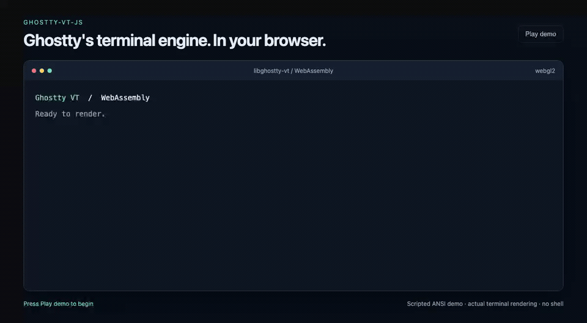
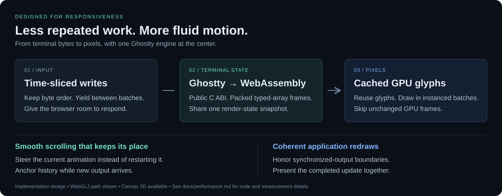

# ghostty-vt-js

**Ghostty's VT engine. A fast, fluid web terminal.**

An interactive TypeScript terminal built on Ghostty's **public C ABI**, compiled to WebAssembly. WebGL2 rendering, smooth scrollback, and the same engine on your backend—with React and PTY session integration included.

[Try it live](https://gkoreli.github.io/ghostty-vt-js/) · [Get started](docs/getting-started.md) · [Why it's fast](docs/performance.md) · [Compare](docs/comparison.md) · [Develop](docs/development.md)

[](docs/media/terminal-demo.mp4)

[Watch the video](docs/media/terminal-demo.mp4) · [Run it yourself](docs/development.md) · [What the live metrics mean](docs/performance.md#read-the-live-showcase-metrics)

## Why pick this terminal?

- **Fast output, less repeated work.** Ghostty parses terminal state in WASM. Packed typed arrays feed a GPU glyph cache and instanced drawing; unchanged frames skip GPU drawing. An ordered, time-sliced write queue gives other browser work a turn.
- **Scrolling that follows your hand.** Pixel-precise wheel input steers an ongoing animation instead of restarting it. New output preserves your position in history. Synchronized output keeps partial application redraws off screen.
- **One engine from browser to backend.** Use the interactive terminal, or run headlessly and export text, HTML, and ANSI. The included PTY host and optional React component share a geometry and session protocol.
- **A direct path to upstream Ghostty.** Public `libghostty-vt` C bindings, an unpatched upstream build, and a pinned WASM artifact. Source, wrappers, declarations, and tests advance together.



[See the implementation behind these choices](docs/performance.md). The video shows a paced workload with real capture-time metrics; it does not establish a cross-library speed ranking.

## Start building

```bash
bun add @gkoreli/ghostty-vt-js
```

Prebuilt WASM and TypeScript declarations included. No Zig or Ghostty desktop installation needed. The browser API is framework-free; React is optional. Canvas 2D is available when WebGL2 cannot be acquired.

**[Browser quickstart →](docs/getting-started.md#browser-quickstart)** · [React + sessions](docs/getting-started.md#react-and-pty-sessions) · [Headless](docs/getting-started.md#headless-terminal)

## How it fits

| | ghostty-vt-js | coder/ghostty-web | xterm.js |
|---|---|---|---|
| Engine integration | Ghostty's public C ABI → WASM | Ghostty + custom WASM API patch | Independent TypeScript engine |
| Browser renderer | Built-in WebGL2 + Canvas 2D | Canvas 2D | DOM + optional WebGL2 addon |
| Beyond the browser | Headless, React adapter, PTY session host | Browser-focused API | Headless package and addon ecosystem |

[Full comparison, sources, and migration tradeoffs →](docs/comparison.md)

Inspired by [Coder's ghostty-web](https://github.com/coder/ghostty-web), with derived browser code and xterm.js write-queue attribution preserved. Choose this library for its Ghostty C-ABI integration and shared browser/server foundation; evaluate xterm.js when its existing addons or screen-reader support are essential.

## Know the scope

Browser: WebAssembly + Canvas; WebGL2 enables acceleration. Server: Node.js 22+ or Bun 1.4.2+. React: optional, 18+.

Some Ghostty capabilities still need browser integration, including inline Kitty graphics, focus reporting, and OSC 52 effects. Replay restores screen content/styles, not every application mode. See [compatibility](docs/getting-started.md#scope-and-compatibility) before migrating.

This monorepo also publishes the independent [`@gkoreli/ghostty-mcp`](packages/ghostty-mcp), a macOS CLI/MCP adapter for the Ghostty desktop app.

[Architecture](docs/architecture.md) · [Development](docs/development.md) · [Security](SECURITY.md) · [MIT license](LICENSE) · [Third-party notices](THIRD_PARTY_NOTICES.md)

Unofficial community project. Not affiliated with or endorsed by Ghostty.
